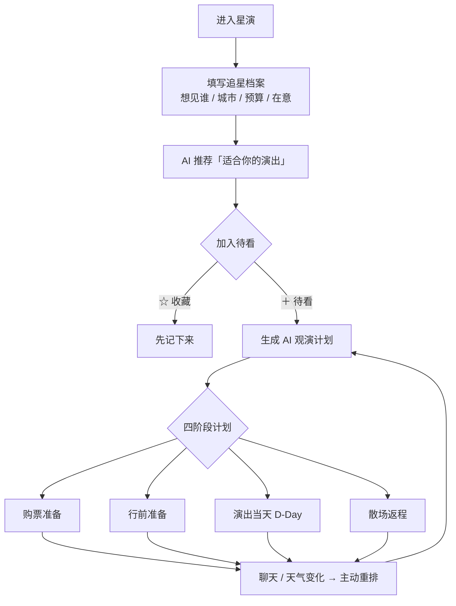
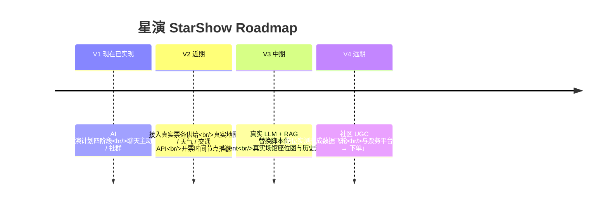

# 星演 StarShow · 你的演唱会管家

> **每一次出发，都是为了见想见的人。**

**星演（StarShow）** 是一款面向追星 / 观演人群的 **AI 观演规划 Agent**：大麦给你「信息」，星演给你「决策」和「陪伴」——不止帮你选对座位，还帮你生成并管好一整套观演计划，陪你走完从「官宣」到「散场」的全程。

**Demo 链接**：https://zz10965-alt.github.io/starshows-ai/ （高保真交互原型，全程可点，纯前端 mock 数据）

---

## 一、背景与痛点

从「官宣」到「散场」，每个观演者都要经历一遍同样焦虑又繁琐的流程：

| 阶段 | 痛点 | 现状 |
| --- | --- | --- |
| 抢票前 | 选座纠结，静态座位图只告诉你「位置在哪」，不告诉你「体验如何」 | 跨平台刷大量「XX场馆·XX区实测」攻略 |
| 开票时 | 信息分散、容易错过开票，决策却是秒级的 | 手动拼凑、反复比对，未必贴合自己预算与偏好 |
| 出发前 | 不知道能带什么、住哪里、几点出发，行程没人管 | 各平台零散查，酒店/交通/天气/清单自己拼 |
| 变化时 | 抢到不同票档、临时改主意、天气变了，计划不会自己更新 | 自己推倒重算 |
| 看完后 | 晒票、安利文案要现写，行程没一个地方记 | 票根躺在相册里，记忆靠回忆 |

**核心洞察：座位图 ≠ 决策；一次买票 ≠ 一段旅程。** 用户需要的不是更多「信息」，而是一个能理解目标、生成计划、并在变化时主动重排的 **Agent**。

---

## 二、目标用户

- **核心用户**：16–30 岁、愿意为现场娱乐付费的追星 / 观演人群（以女性粉丝为主，决策参与度与分享欲最高）。
- **高频场景**：① 新巡演官宣 → 抢票前选档位；② 抢票倒计时 → 查攻略 / 做 checklist；③ 抢到票 → 生成完整观演计划；④ 出发前 → 天气 / 交通 / 清单；⑤ 现场当天 → 跟着 D-Day 路线走；⑥ 临时变化 → 「演出结束想吃火锅」「不住酒店了」→ Agent 重排。

---

## 三、产品定位与差异化

不做第二个售票平台，也不做旅行 App，而是做 **购票决策层 + 观演计划 Agent 层 + 同好社群层**：

| 竞品 | 优势 | 缺口 |
| --- | --- | --- |
| 大麦 / 猫眼 | 票务供给全、座位图 / 价格齐全 | 只有静态信息，无个性化选座建议，更无「观演计划」与主动重排 |
| 票星球 / 秀动 | 部分演出垂直供给、社区化 | 票种单一、场次覆盖有限 |
| Ticketmaster（海外） | 有 Seat Map 与 AI 推荐雏形 | 无「对话式 + 可解释」的个性化决策，无旅程级 Agent，对中国场馆场景适配弱 |
| 地图 / 旅行 App | 路线规划强 | 不做演唱会场景：不懂抢票、选座、安检、应援、散场 |

**差异化定位**：把「看懂座位图」升级为「被 AI 推荐一个适合我的座位并知道为什么」，再往前一步——**一个能生成、执行、并随变化主动重排整段观演计划的 Agent**。

---

## 四、核心交互流程

核心闭环：**目标 → 理解 → 生成计划 → 执行 → 变化重排**，而不是传统 chatbot 的「你问一句、它答一句」。

---

## 五、现有功能（V1 · 已实现）

### 5.1 可解释选座
对场馆各档位做「视野 / 音响 / 距离 / 价格」多维打分，输出可解释推荐 + 备用档位；切换偏好（离爱豆近 / 听感好 / 性价比）推荐实时变化；附场馆剖面图视角预览（「你在这里」标记 + 视线线）。

### 5.2 AI 观演计划（Timeline）
把散落的酒店 / 交通 / 天气 / 清单，升级成按「现在做 / 尽快做 / 自动更新」排的 Timeline：

- 四阶段：**购票准备 / 行前准备 / 演出当天 / 散场返程**，各自独立可点，左 Timeline + 右 Context Panel 点击联动。
- 带进度条、可「标记完成」、可自定义清单项（含自拍杆等违禁冲突提示）。
- **D-Day「今日观演」**：演出当天切成完整当日路线（时间线 ↔ 简化地图点击联动）。
- **散场返程**：独立返程路线，与所选酒店联动。

### 5.3 住宿 / 城际交通 · 计划内直接选
- 住宿从「尚未确定」出发 →「✨ 帮我挑几家」给出 3 家（含推荐理由）→ 选中后「更换 / 编辑 / 删除」，D-Day 路线与散场返程自动跟随；「查看酒店周边」弹出酒店周边模拟地图。
- 城际交通同理（方案 A / B + 自添加），选中即「城际交通已确定」。用户始终拥有最终决定权。

### 5.4 场馆周边攻略
地图 + 分类 chips（演出前吃 / 散场夜宵 / 等人 / 打卡 / 周边 / 酒店 / 地铁 / 上车点 / 寄存），每个 POI 有「为什么适合你的计划」+「＋ 加入我的计划」，点了真把地点插进 Timeline 并重算时间。

### 5.5 聊天控制计划（Agent 主动重排）
小星直接改计划：不住酒店了 → 删酒店改当天往返；抢到 880 的票 → 状态切「已经有票」、收起抢票任务；演出结束想吃火锅 → 插入火锅；换个便宜酒店 → 展示「预计省 ¥240 但多 6min」+「就这样调整 / 先不改」。所有调整与手动编辑共用同一份计划状态。

### 5.6 个人档案 + 收藏/待看两级
- 档案可编辑、可持久化（想见谁 / 城市 **支持多选**，另有所在地 / 时段 / 预算 / 在意），推荐与计划实时跟着档案变。
- **收藏** = 感兴趣先记下来；**待看** = 确定要去 / 要抢，是生成计划的入口。

### 5.7 每场自带粉丝社群
按「拼房 / 拼车 / 找搭子 / 应援 / 转票」分频道群聊，未加入时展示「3,218 人正在讨论 + 热门标签」，加入后才进群；群内有用信息可与计划轻量联动（保存到计划 / 加入返程备选）+ 防诈骗提示。

---

## 六、未来规划（Roadmap）

- **V2 近期**：把 mock 数据换成真实票务、地图、天气、交通 API；补上开票时间节点推送。
- **V3 中期**：用真实 LLM + RAG 替换脚本化 Agent，接入真实场馆座位图与历史测评数据，让推荐更可信。
- **V4 远期**：引入社区 UGC 座位实测形成数据飞轮；与票务平台合作，把「决策」直接衔接「下单」。

---

## 七、北极星指标

- **核心指标**：加入「待看」→ 生成计划 → 走完「抢票 → 行前 → 当天 → 散场」的用户占比（**观演计划完成率**）。
- **辅助指标**：档案完整率、推荐 / 票档采纳率、Timeline 任务完成率、Checklist 勾选率、聊天改计划采纳率、POI 加入计划率、从建档到生成计划的转化时长。

---

## 八、Demo 体验路径

1. 首次进入已内置演示数据（档案已填、待看 + 观演计划已生成、有示例群聊），点「↻ 重置 Demo」可随时恢复默认。
2. 🏠 我的主页：看「最近适合你的演出」+ 右栏「我的观演计划」「我的群聊」。
3. 点演出卡 → 演出详情（选座 / 陪你走到线下 / 场馆周边 / 粉丝社群 四模式）。
4. 💺 选座建议：切换偏好看推荐变化 + 剖面图视角预览。
5. 回主页点「继续计划 →」→ 进入 AI 观演计划页，四阶段各自独立可点。
6. 行前准备 → 住宿：「✨ 帮我挑几家」→「选择这家」，或「＋ 添加我的酒店」；「查看酒店周边」看模拟地图。
7. 行前准备 → 城际交通：选方案 / 自添加行程。
8. 演出当天 → D-Day 当日路线 + 路线图联动；散场返程 → 返程路线。
9. 👥 粉丝社群 →「加入场次群」→ 群内信息「保存到计划」。
10. ✨ 问问小星：输入「帮我换个便宜一点的酒店」→「就这样调整」→ 计划同步改。

> 💡 本 Demo 为高保真交互原型，AI 问答为内置交互脚本，未接入真实 AI / API，所有数据均为 mock 演示。

---

## 附：简历条目（可直接粘贴）

> **项目8：星演 StarShow —— AI 演唱会全流程规划 Agent（产品原型）**
> 链接：`https://zz10965-alt.github.io/starshows-ai/`
> 时间：2026.09–至今　职务：独立设计与开发　地点：美国·纽约　人数：个人
> 从本人常年追星、看演唱会的真实痛点出发（静态座位图不够清楚、攻略散落各平台、行程没人管），独立设计并开发一款「AI 观演规划 Agent」：用可编辑档案（想见谁/城市/时段/预算/在意）驱动演出推荐；选座环节对场馆各档位做「视野/音响/距离/价格」多维打分并输出可解释推荐；「加入待看」作为规划触发器，一键生成完整观演计划（抢票→住宿→交通→天气→行前 Timeline + 演出当天 D-Day 路线图）；场馆周边 POI 一键插入计划、天气变化自动重排、聊天直接改计划。亮点是「可解释选座 + 全流程观演计划 Agent + 上下文变化主动重排」直接切入大麦核心购票场景，并配套竞品分析、北极星指标与 MVP 取舍，完整呈现从痛点洞察到原型迭代的产品闭环。

---

*本项目为求职作品，采用高保真交互原型（纯前端模拟 + localStorage 持久化，无后端），重点展示产品思考与交互设计。*
